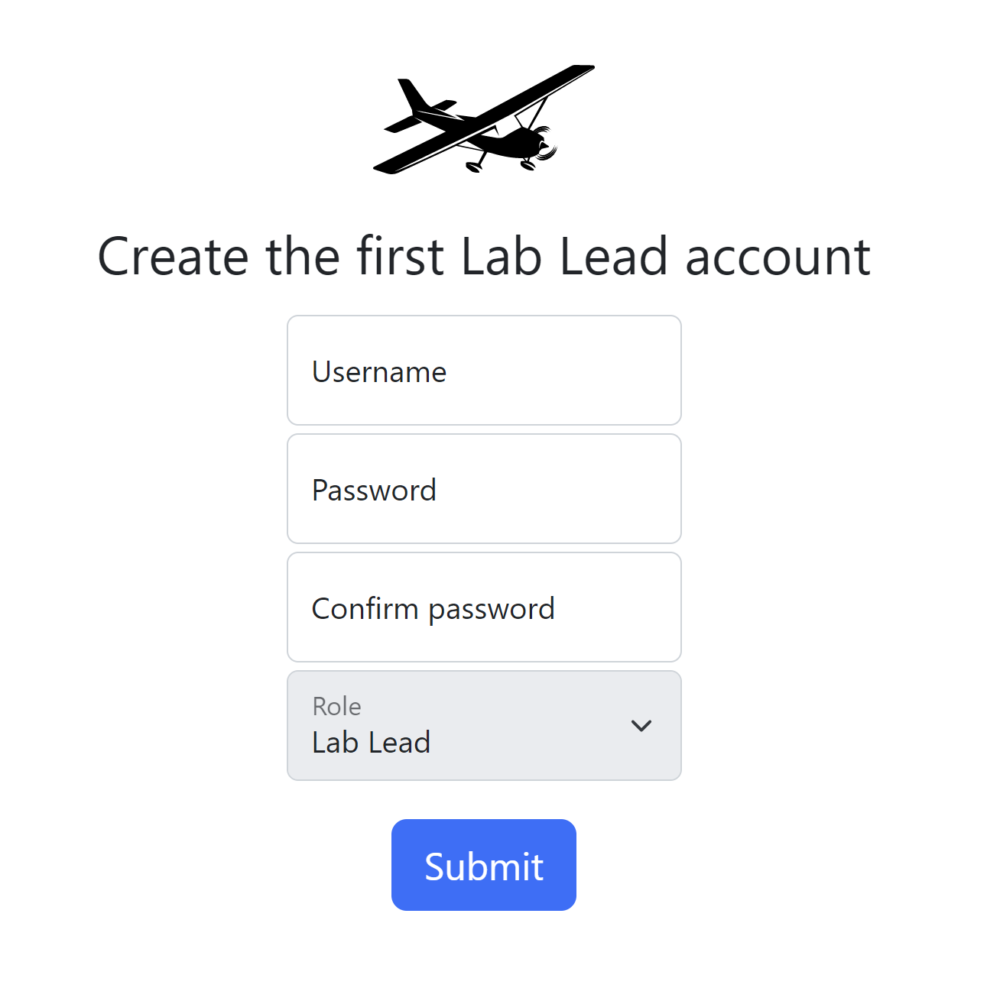

# Administration

Once Scout is running on your server, you can set up the system to be ready for data processing. You'll need to create the first login to do any other administration.

## Create the First Login

As a Lab Lead, your first contact with **Scout** is after the System Administrator installed it and provided you with a link. Open the link using the **Google Chrome browser** and create your Lab Lead account. *(Note: This step is not needed if the System Administrator provided you with login credentials.)*

Here's how to create your Lab Lead account:

1. Fill out the **Username** field.
2. Create a password and confirm it in the **Password** and **Confirm password** fields.
3. Click **Submit**. Your Lab Lead account is now available, and should be visible in the **Users** page. You can start creating accounts for Annotators.



```{note}
While you can perform all of the Lab Lead duties in Scout from any Chrome browser that can access it, you may also want to obtain access to the Scout Server laptop to be able to add aerial survey images to Scout’s image ingestion folder (see the Add survey images to Scout section of this document). Ask your System Administrator for an Ubuntu Desktop account to log into the server. Your account also needs access to the image ingestion folder created by the System Administrator.
```

```{toctree}
:maxdepth: 1

manage-users
manage-labels
manage-task
delete
```
