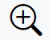
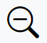
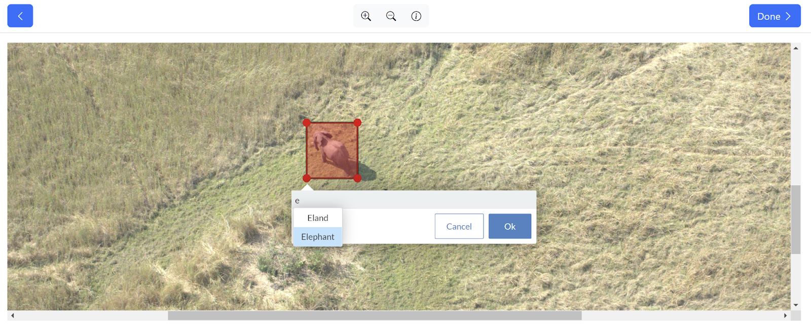
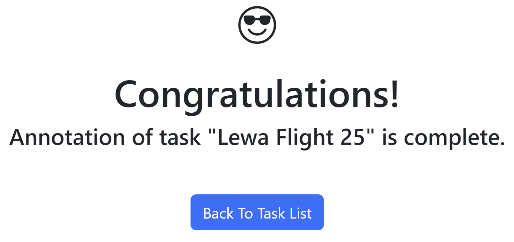

# Manually Annotate Tasks

If an unfinished task is assigned to you directly, you can click the **Annotate button** next to the task on the **Tasks table** to begin annotating randomly presented images. The annotation screen allows you to *click-drag* to create a bounding box. Use the down arrow key or begin typing to select the correct label for the annotation. In addition to the *click-drag* motion for creating annotations, the following tools are available to you in the annotation interface:

* zoom in button 
* zoom out button 
* **scroll bars** to pan across the image to look for parts to annotate
* back button 
* **Done** to finish the ground truth stage of this image, making it as completely and accurately done. If any annotations were created, modified, or destroyed, they are now saved as ground truth. If no annotations were present when Done was clicked, the image is considered empty.

```{note}
If you refresh your Chrome browser, the interface presents a new random image, and your work on the image you saw before is not stored.
```


Once you finish annotating the images, a page noting the successful completion of annotation for the task appears. Click the **Tasks button** on the menu to return to the **Tasks view and start** your next assigned task.


## Annotation Toggle

When annotating or ground truthing a task, annotation labels can be applied to specific regions or objects in an image as tags or markers.

Toggle the visibility of the annotation labels and label delete buttons by clicking the **Show Labels** checkbox in the bottom left corner:

* Toggle the checkbox on to view the annotation labels and trash can icons to delete annotation labels. This is the default state.
* Toggle the checkbox off to hide the annotation labels and delete buttons, so the image and annotations are fully visible.