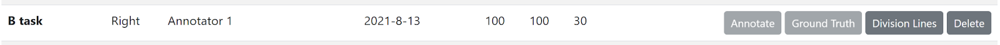
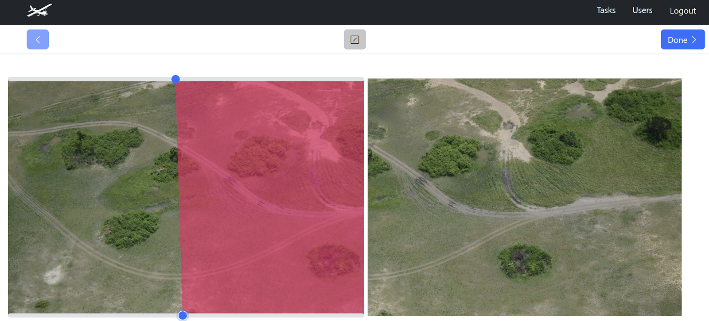

# Draw Division Lines

Division Lines allow you to note a single area of overlap between two images that meet the following criteria:

* Images are successive and in sequence by date
* At least one annotation appears in both images

Division Lines are intended to help note areas of overlap in successive images so that overcounting can be minimized. Division Lines are drawn on a task-by-task basis, and drawing Division Lines is only possible after a task has achieved 100% annotation and growth truth review. *(Note: Drawing division lines is optional.)*

To draw **Division Lines,** go to the Tasks view and select a task from the table. If the task is ready for Division Lines, the **Division Lines** button becomes clickable.


```{note}
Not all images are made available for division lines. Division lines only need to be set between successive pairs of images that might have overlapping areas, and both must have annotations to be considered for division lines.
```

The Division Lines screen provides you with a side-by-side view of two successive images in a sequence. Drawing Division Lines is a stage that requires the side of the plane (Left or Right) to be accurately set on the task to ensure the images are sequenced correctly. The tools available in the Division Lines screen are:

* Back button 
* **Done** - completes the division line stage of this image pair, making it as completely and accurately *done*.
* **Sliders** - the top and button sliders control the start, end, and slope of the line. To the best of your ability, use the slider to define the overlap area between the left and right images.



