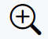
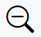
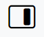
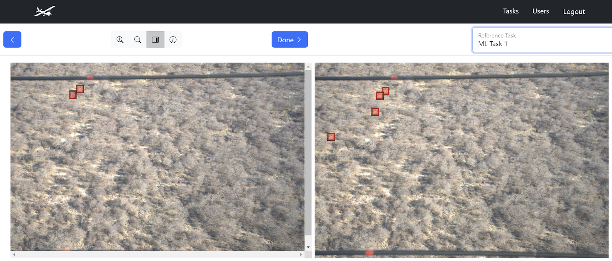

# Ground Truth Review

The Ground Truth stage of a task involves a review of its images and annotations for accuracy by a lab lead. The purposes of the ground truth stage are to:

* Assess annotator accuracy.
* Define final, correct annotations for an image. Once an image has been through the ground truth stage, no matter how many tasks it appears in, that image is considered DONE. It will never appear again for Annotation or Ground Truth.

```{note}
When you delete an annotation as part of the ground truth process, you do not delete it from the task. Rather, the deleted annotation is no longer considered a part of the final set of annotations that make up the ground truth.
```

When exporting annotations, it is important to understand which Annotations are Ground Truth annotations as these are considered the most accurate representation of the content of each image. See [Exporting task annotation and image data for analysis](export-data.md) for more information.

If a task is fully annotated but has not been 100% through the Ground Truth stage yet, you can click the **Ground Truth** button next to the task on the Tasks table to begin reviewing randomly presented images and their annotations.

1. The **Annotation screen** allows you to *click-drag* to create a new bounding box and then press the down arrow or begin typing to select the correct label for the annotation.
2. You can click on any previously created annotation to edit it. A **trash can** 
3. In addition to the *click-drag motion* for creating annotations, the following tools are available to you in the annotation interface:

*  zooms in on the image.
*  zooms out of the image
* **scroll bars** for the image allow you to pan across the image looking for parts to annotate
*  returns to the last image annotated in this annotation session
* **Done** to finish the ground truth stage of this image, making it as completely and accurately *done*. If any annotations were created, modified, or destroyed, they are now saved as ground truth. If no annotations were present when **Done** was clicked, the image is considered empty.
*  opens a side-by-side display that allows you to compare annotations for this image to other tasks that contain this image. The **Reference Task** pulldown allows you to switch between other tasks that include annotations on this image. This allows you to perform your ground truth review in the context of multiple annotators (*including ML*) who may find and miss correct annotations in different ways. However, what you annotate in the left window on the image is considered the final and correct Ground Truth for the image.


Once Ground Truth is complete *(i.e. reaches 100%),* a window will pop out confirming that the changes have been saved.

## Annotation Toggle

When annotating or ground truthing a task, annotation labels can be applied to specific regions or objects in an image as tags or markers.

Toggle the visibility of the annotation labels and label delete buttons by clicking the **Show Labels** checkbox in the bottom left corner:

* Toggle the checkbox on to view the annotation labels and trash can icons to delete annotation labels. This is the default state.
* Toggle the checkbox off to hide the annotation labels and delete buttons, so the image and annotations are fully visible.